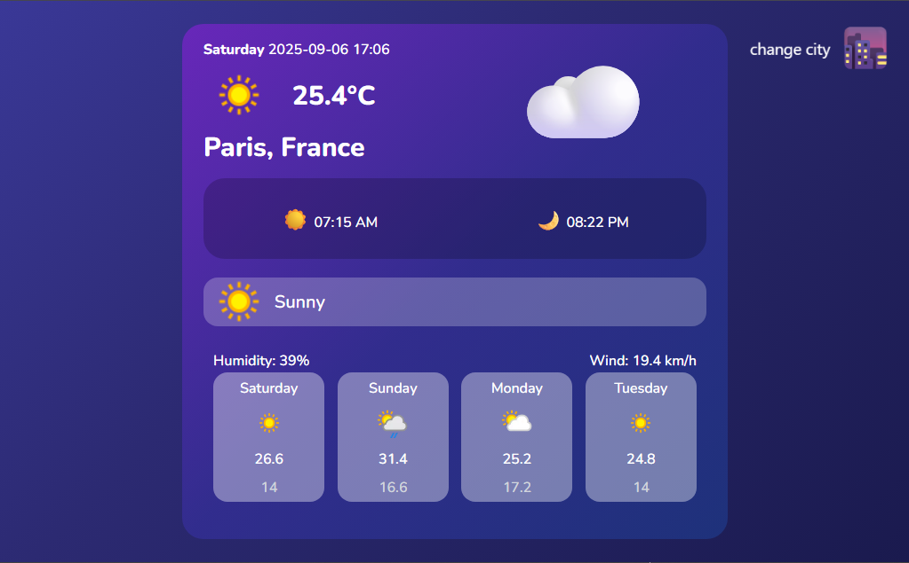
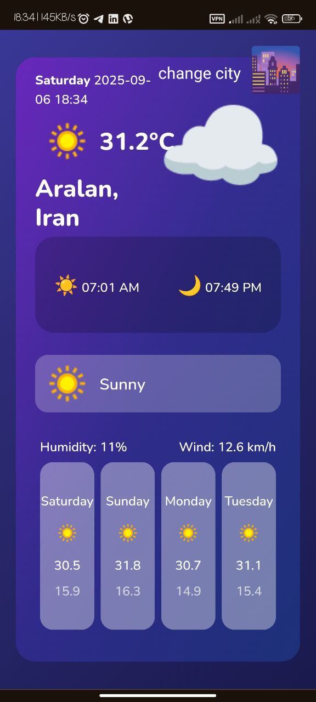

# Weather-Application  

☁️ **Weather App with PWA Support**  

This project is a modern and responsive **Weather Application** built with HTML, TailwindCSS, and JavaScript.  
It fetches real-time weather data from the **[weatherapi.com](https://weatherapi.com) API**.  
The main focus is on providing a **smooth user experience**, **real-time data**, and **PWA installability** across devices.  

✨ Key Features:
- Fetch live weather data from **API**  
- Display temperature, feels-like, humidity, wind speed, pressure, visibility, UV index  
- Show forecast for upcoming days  
- Installable on Home Screen (PWA)  
- Offline access with Service Worker caching  
- Responsive design with **Tailwind CSS**  
- Modern UI with smooth animations  

---

## Demo  

Demo: [Show App](https://weather-app-kappa-swart-38.vercel.app/)  

---

## Screenshots  

  
  

---

## Features  

- 🌡️ Real-time weather data from **weatherapi.com API**  
- 📆 Multi-day forecast with detailed info  
- 📱 PWA with install support on mobile/desktop  
- 🎨 Responsive and modern design with TailwindCSS  
- ⚡ Lightweight and fast with Vanilla JS  

---

## Teacher  

This project was created under the guidance of:  
**[[Parsa Ghorbanian](https://github.com/parsaGhorbanian)]**  

---

## Run Locally

Clone the project

```bash
https://github.com/mohammademami2005/weather-app
```


Install dependencies

```bash
  npm install
```

Start the server

```bash
  npm run dev
```
